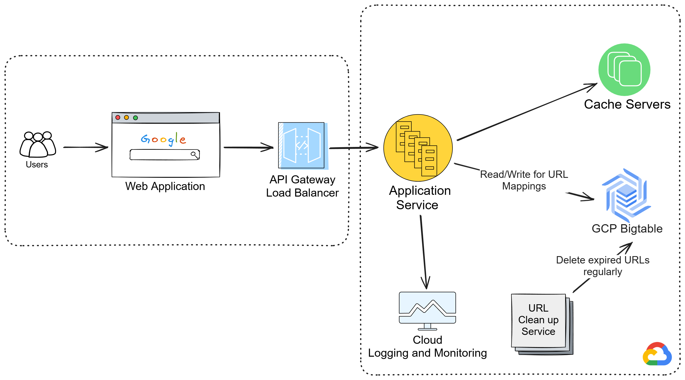

# URL Shortener Service - Group2

## Project Overview
This project is a highly scalable and distributed **URL Shortener Service** deployed on **Google Cloud Platform (GCP)**. The service efficiently generates and resolves short URLs while ensuring high availability, low latency, and optimized caching. The system is designed to handle thousands of requests seamlessly.

## Team Members & Roles
| Role                  | Team Member(s) |
|-----------------------|---------------|
| **Team Leader**      | Zilong Xue |
| **Backend Developers** | Krishna Esanakula, Zilong Xue |
| **Frontend Developers** | Haotian Zheng, Shen Gao |
| **Tester & Tech Support** | Sid Wang |
| **Deployer** | Tong Wu |
| **Documentation** | All Members |

## System Architecture

Our URL Shortener service follows a **distributed microservices architecture** with the following components:

1. **Frontend (Web Application UI)**: Built by frontend developers, allowing users to enter URLs for shortening and retrieving analytics.
2. **API Gateway & Load Balancer**: Handles incoming requests, routes them efficiently to backend services, and ensures system scalability.
3. **Application Service (Backend Logic)**:
   - Processes URL shortening and resolution requests.
   - Includes the **URL Cleanup Service**, which periodically removes expired links.
4. **Database Storage (GCP Bigtable)**: Optimized for fast read/write operations, efficiently mapping short URLs to long URLs.
5. **Cache Servers**: Store frequently accessed URLs to enhance performance since read operations outnumber writes.
6. **Logging & Monitoring**: Uses **Cloud Logging and Monitoring** to track system health and performance metrics.

## Tech Stack
- **Frontend**: React.js (UI components), CSS, JavaScript
- **Backend**: Java
- **Database**: Google Cloud Bigtable (NoSQL)
- **Caching**: Redis (for frequently accessed URLs)
- **Deployment & Cloud Services**: Google Cloud Platform (GCP) - Cloud Run, Cloud Functions, Cloud Load Balancing
- **Monitoring & Logging**: Google Cloud Logging & Monitoring
- **Testing**: Unit tests, Postman, Jmeter

## Timelines & Milestones
| Date Range | Milestones |
|------------|---------------------------------|
| Jan 31 – Feb 20 | ✅ Set up infrastructure & core functionality |
| Feb 21 – Mar 20 | 🔗 Add project features |
| Mar 21 – Apr 10 | 📊 Implement Custom Alias, User Account System, Testing |
| Apr 11 – Apr 15 | 🚀 Performance Tuning, Security Enhancements |
| Apr 11 – Apr 15 | 🏁 Deployment & Maintenance |

## Contributions
- Fork the repository, create a feature branch, and submit a PR.
- Follow the project coding standards and guidelines.

